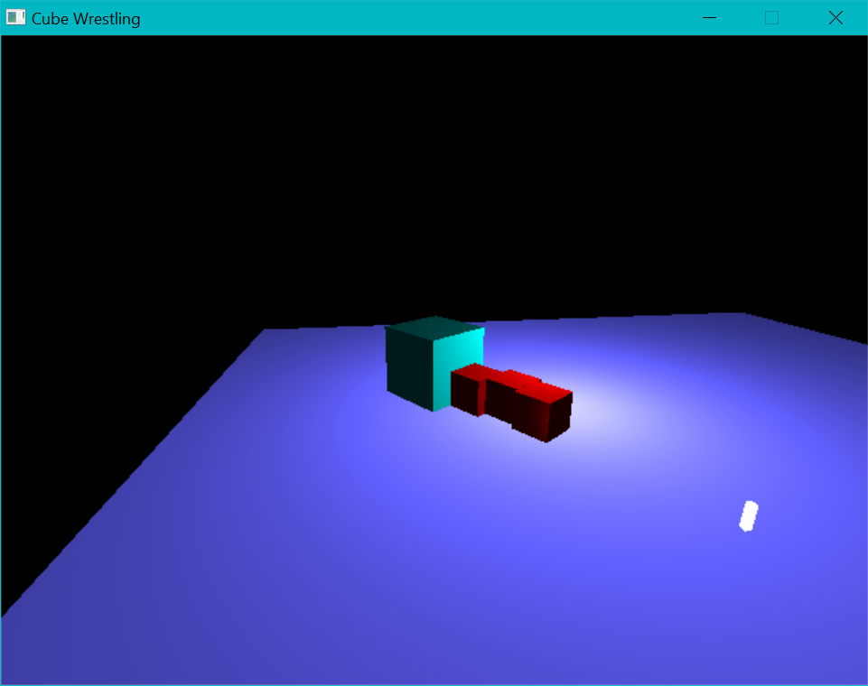

# Capstone Project: Cube Wrestling

Cube Wrestling is a trivial game written in C++, using SDL2, OpenGL 3.3, and Bullet Physics. The goal of the game is to push red cubes off of the arena.





The player controls the blue-ish cube. To move the cube, click on the arena. Left-click pulls the cube toward the click location, right click pushes it away.
Press `space` to jump/hover, press `z` to break/roll. Hold shift to accelerate faster.
As more enemy cubes are pushed off of the arena, player's cube becomes larger and more massive, which somewhat helps deal with increasing numbers of red cubes, but also means the player becomes slower.
Player falling off the arena resets the progress and reverts to just one red cube.
The point of the game is to push off as many red cubes as possible.


## Building
The project should build with CMake/Make.


## Required packages
- SDL2, SDL2_gfx
- Bullet Physics
- OpenGL 3.3 (or newer)
- GLEW

Seems like everything was already installed on the workspace, in case something was missing, here's a list of some package names for `apt install`
```
libglew-dev/xenial,now 1.13.0-2 amd64 [installed,automatic]
libglew1.13/xenial,now 1.13.0-2 amd64 [installed,automatic]
libbullet-dev/xenial,now 2.83.6+dfsg-3 amd64 [installed,automatic]
libbulletcollision2.83.6/xenial,now 2.83.6+dfsg-3 amd64 [installed,automatic]
libbulletdynamics2.83.6/xenial,now 2.83.6+dfsg-3 amd64 [installed,automatic]
libbulletsoftbody2.83.6/xenial,now 2.83.6+dfsg-3 amd64 [installed,automatic]
freeglut3/xenial,now 2.8.1-2 amd64 [installed,automatic]
freeglut3-dev/xenial,now 2.8.1-2 amd64 [installed]
libglu1-mesa/xenial,now 9.0.0-2.1 amd64 [installed]
libglu1-mesa-dev/xenial,now 9.0.0-2.1 amd64 [installed,automatic]
```


## Running
Embedded paths assume shaders can be found at `../shaders`, which should be fine if running from `[project root]/build`.
The project requires OpenGL 3.3 support.
To run in a standard desktop workspace, before starting the program run `export MESA_GL_VERSION_OVERRIDE=3.3`

## Capstone requirements

#### The project demonstrates an understanding of C++ functions and control structures.
   /src/app.cpp - implementation of a basic SDL2 application

#### The project reads data from a file and process the data, or the program writes data to a file.
   /gfx/shader.cpp - loading shader source for compilation

#### The project accepts user input and processes the input.
   /src/app.cpp - user input is handled in App::mainLoop()
   
#### The project uses Object Oriented Programming techniques.
    /src/app.hpp
    /src/app.cpp - main application class uses many other classes

#### Classes use appropriate access specifiers for class members.
    /src/app.hpp
    /src/app.cpp - starting from the main application class, member access is usually restricted in classes.                     

    /src/managers/SceneManager.hpp - unmodifiable fields are private and available via const getters.                     
#### Class constructors utilize member initialization lists.
    /src/app.cpp - manager hierarchy is mostly initialized in the App::App() constructor, in the initializer list. 
                   Class member order is important here. 
#### Classes encapsulate behavior.
    /src/managers/* - different managers handle various aspects of running the game, often allocating and freeing up resources
    
#### The project makes use of references in function declarations.
    /src/managers/sceneManager.cpp, SceneManager::addEnemy() - GameObject reference grabbed from std::List::enplace_back()
    /src/managers/modelManager.cpp, ModelManager::getMeshData() - Returns a reference to a MeshData struct that exists inside the manager
     
#### The project uses destructors appropriately.
    While there are no manually allocated resources that are freed in destructors, 
    many classes have destructors defined so that unique pointers can free their resources to types forward-declared in the header file  

#### The project uses smart pointers instead of raw pointers.
    /src/app.hpp
    /src/app.cpp - all heap allocated resources are wrapped in unique pointers     
